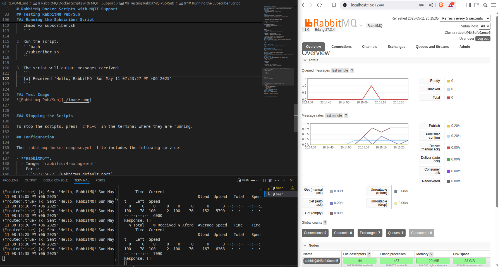

# RabbitMQ Docker Scripts with MQTT Support

This repository contains a `docker-compose.yml` file to set up a RabbitMQ server with the Management UI and MQTT support, along with scripts to test RabbitMQ's pub/sub functionality using Bash scripts.

## Prerequisites

- Docker installed on your system.
- Docker Compose installed.
- `jq` installed for parsing JSON in the subscriber script:
  ```bash
  sudo apt install jq
  ```

## Usage

1. Clone this repository or navigate to your project directory.

2. Ensure you have the following `rabbitmq-docker-compose.yml` file in your directory.

3. Start the RabbitMQ service using the following command:

   ```bash
   docker compose -f rabbitmq-docker-compose.yml up -d --build
   ```

4. Verify that the RabbitMQ container is running:

   ```bash
   docker ps
   ```

5. Access the RabbitMQ Management UI:
   - Open your browser and navigate to `http://localhost:15672`.
   - Use the following credentials to log in:
     - Username: `user`
     - Password: `root`

## Enabling MQTT Support

RabbitMQ supports MQTT via the MQTT plugin. The plugin is included in the RabbitMQ image but needs to be enabled.

1. Enable the MQTT plugin:
   ```bash
   docker exec -it rabbitmq rabbitmq-plugins enable rabbitmq_mqtt
   ```

2. Verify that the MQTT plugin is enabled:
   ```bash
   docker exec -it rabbitmq rabbitmq-plugins list | grep mqtt
   ```

   You should see `rabbitmq_mqtt` with `[E*]` indicating it is enabled.

3. MQTT will now be available on port `1883` (default MQTT port).

## Testing MQTT with RabbitMQ

You can use an MQTT client like `mosquitto_pub` and `mosquitto_sub` to test MQTT functionality.

### Install Mosquitto (if not already installed)

On Ubuntu, install Mosquitto using:
```bash
sudo apt install mosquitto-clients
```

### Publish a Message Using MQTT

Run the following command to publish a message to the `test_mqtt` topic:
```bash
mosquitto_pub -h localhost -p 1883 -t test_mqtt -m "Hello, MQTT!" -u user -P root
```

### Subscribe to the Topic Using MQTT

Run the following command to subscribe to the `test_mqtt` topic:
```bash
mosquitto_sub -h localhost -p 1883 -t test_mqtt -u user -P root
```

You should see the message `Hello, MQTT!` in the subscriber terminal.

## Testing RabbitMQ Pub/Sub

This repository includes two Bash scripts to test RabbitMQ's pub/sub functionality: `publisher.sh` and `subscriber.sh`.

### Running the Publisher Script

The `publisher.sh` script sends a message to the `test_queue` queue every 5 seconds.

1. Make the script executable:
   ```bash
   chmod +x publisher.sh
   ```

2. Run the script:
   ```bash
   ./publisher.sh
   ```

3. The script will output messages being sent:
   ```
   [x] Sent 'Hello, RabbitMQ! Sun May 11 07:53:27 PM +06 2025'
   ```

### Running the Subscriber Script

The `subscriber.sh` script listens to the `test_queue` queue and prints messages received.

1. Make the script executable:
   ```bash
   chmod +x subscriber.sh
   ```

2. Run the script:
   ```bash
   ./subscriber.sh
   ```

3. The script will output messages received:
   ```
   [x] Received 'Hello, RabbitMQ! Sun May 11 07:53:27 PM +06 2025'
   ```

### Test Image



### Stopping the Scripts

To stop the scripts, press `CTRL+C` in the terminal where they are running.

## Configuration

The `rabbitmq-docker-compose.yml` file includes the following service:

- **RabbitMQ**:
  - Image: `rabbitmq:4-management`
  - Ports:
    - `5672:5672` (RabbitMQ default port)
    - `15672:15672` (Management UI port)
    - `1883:1883` (MQTT port)
  - Default credentials:
    - Username: `user`
    - Password: `root`
  - Storage is persisted using a Docker volume.

## Stopping the RabbitMQ Service

To stop and remove the RabbitMQ container, run:

```bash
docker-compose -f rabbitmq-docker-compose.yml down
```

## License

This project is licensed under the MIT License.